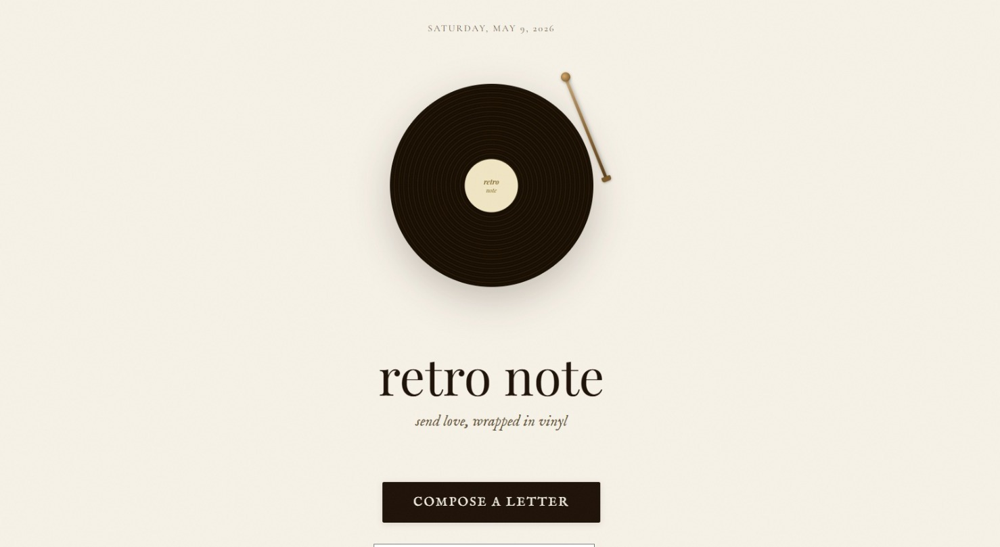
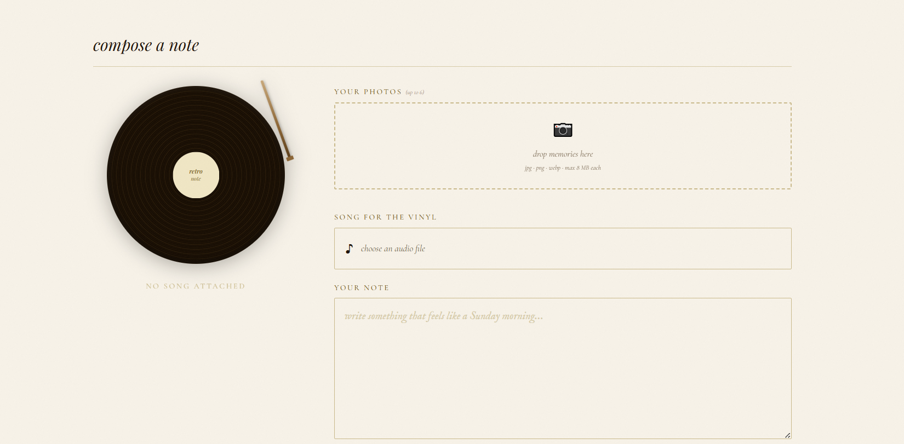
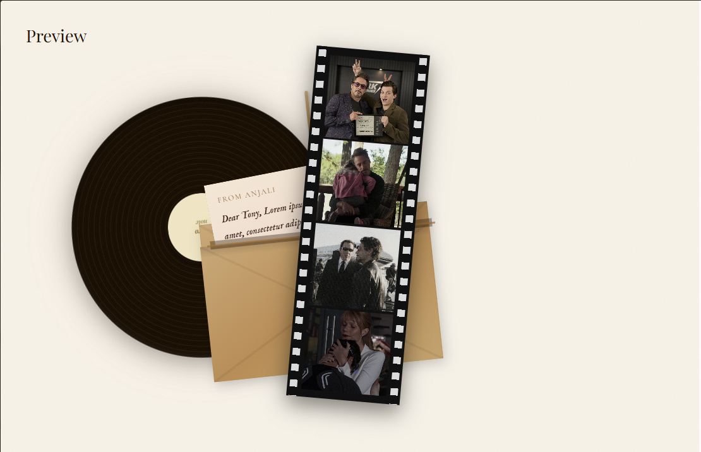

# retro·note

*send love, wrapped in vinyl.*

---

we've forgotten how to say the things that matter.

retro·note is for the message you've been sitting on. the one that deserves more than a text. write it out, tuck in some memories, press a song that says what words can't — and send it as a link that opens like a letter in the mail.

no accounts. no read receipts. no feed. just something real, from you to them, that disappears like it was only ever meant for one person.

**[→ open retro·note](https://retro-note-gamma.vercel.app/)**

---



---

## what you can do

- write a note the way you actually feel it
- attach up to 6 photos — they show up as a polaroid or a film strip depending on how many
- pick 30 seconds of a song and press it onto the vinyl — it plays when they open the letter
- preview everything before you send — envelope, collage, the whole thing
- share one link — they click, the envelope opens, they read while vinyl plays the music or your own voice, anything you want

---

## screenshots

| compose | preview |
|---|---|
|  |  |

---

## built with

| | |
|---|---|
| Frontend | React + TypeScript (Vite) |
| Audio | Web Audio API — trimming, mono downmix, WAV encoding |
| Storage | Cloudinary — photos, audio, and letter metadata |
| Hosting | Vercel |

---

## how it works

1. you write the note, add photos, trim the song
2. everything uploads to Cloudinary
3. the letter metadata — just text and URLs — goes up as a tiny JSON file
4. you get a link: `retro-note.vercel.app/letter#<id>`
5. they open it. the envelope is there. they click it.

---

## run it locally

```bash
npm install
npm run dev
```

runs at `localhost:5173`

---

## project structure

```
retro-note/
|── docs/                     # screenshots
├── src/
│   ├── app/
│   │   ├── ts/
│   │   │   ├── retro.ts      # everything — router, state, page renderers
│   │   │   ├── collage.ts    # builds and wires up the letter collage
│   │   │   ├── audio.ts      # trims audio, encodes to WAV
│   │   │   ├── session.ts    # saves your draft so you don't lose it
│   │   │   └── utils.ts      # small helpers
│   │   └── App.tsx
│   └── main.tsx
└── vercel.json               # SPA routing
```

---

## deploy

push to GitHub, import on [Vercel](https://vercel.com), done. no environment variables needed.

---

## a note on privacy

letter URLs are unguessable — Cloudinary generates a random ID for each upload. only someone with the exact link can open it. there's no database, no user tracking, nothing stored beyond what's needed to deliver the letter.

---

## license

MIT

## 👩‍💻 Author

Made with love by [Anjali Mittal](https://github.com/Anjali-Mittal)
